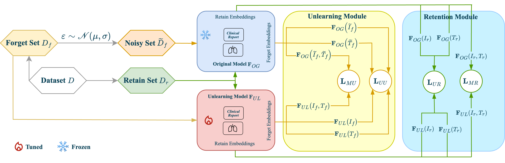

# Forget-MI: Machine Unlearning for Forgetting Multimodal Information in Healthcare Settings

## Summary about Forget-MI 

Forget-MI introduces a novel machine unlearning framework tailored to healthcare, where multimodal patient data (e.g., medical images and clinical text) must be removed upon request without compromising model utility. Unlike existing methods that target either unimodal data or are modality-agnostic, Forget-MI unlearns both unimodal and joint patient representations. This is achieved through a set of carefully designed loss functions that promote forgetting via noise-perturbed embeddings while retaining knowledge from non-forgotten data.

Forget-MI is evaluated on a subset of MIMIC-CXR for edema classification, demonstrating superior privacy protection (measured by Membership Inference Attacks) and reduced performance on the forget set, with negligible drops on the test set. The approach also avoids the inefficiencies of full retraining and scales across different forget-set sizes (3%, 6%, 10%).

The effectiveness of the method is illustrated in the Figure below, which outlines the multimodal unlearning process via four loss components: Unimodal Unlearning (UU), Multimodal Unlearning (MU), Unimodal Retention (UR), and Multimodal Retention (MR).

 <p align="center">
  
  </p>

The paper can be found here:[`arXiv preprint`](https://arxiv.org/abs/2506.23145v1) 

**Note:** This directory will be updated.

Please note that the weights of original model, retrained model with 3% forget size, retrained model with 6% forget size, and retrained model with 10% forget size are available here: [Weights](https://drive.google.com/drive/folders/15_3n6_fqDHVrgJLduWddzoT4wXwkGViQ?usp=sharing )

------- 

## Code Instructions

### 1) Environment
Create the environment from the provided YAML:
```bash
conda env create -f conda_environment.yml
conda activate forgetmi
````

### 2) Paths to Update

Before running, make sure to set these paths in your `config.yaml` or via CLI flags:

* `base_model_path`: directory of the original model checkpoint.
* `retrained_model_path`: directory of a retrained checkpoint.
* `output_dir`: where outputs and checkpoints will be saved.
* `bert_pretrained_dir`: directory of the pretrained BERT/text encoder.
* `text_data_dir`: path to text/metadata files.
* `img_data_dir`: path to image files.
* `synonyms_dir`: path to Synonyms.csv.
* `data_split_path`: CSV with splits.
* `forget_set_path`: CSV of IDs to forget.

### 3) Run Command

#### Run with YAML config
```bash
python training/forgetmi_partial.py --config config.yaml
````

#### Run with Weights & Biases (W\&B) Sweep

After logging in, create the sweep from your YAML:

```bash
wandb sweep config.yaml
```

Then launch an agent:

```bash
wandb agent <SWEEP_ID>
```

Replace `<SWEEP_ID>` with the ID returned after creating the sweep.

<!--


### 4) Key Hyperparameters

* `--noise_mean`: mean of the Gaussian noise distribution.
* `--noise_std`: standard deviation of the Gaussian noise distribution.
* `--alpha`: weight for the main task loss.
* `--beta`: weight for the forgetting loss on the forget set.
* `--theta`: weight for the retention loss on the retain set.
* `--gamma`: weight for the regularization or consistency loss.
 -->

--------

## Citations and Resources

If you use this method or code, please cite:

```
@inproceedings{hardan2025forgetmi,
  title={Forget-MI: Machine Unlearning for Forgetting Multimodal Information in Healthcare Settings},
  author={Hardan, Shahad and Taratynova, Darya and Essofi, Abdelmajid and Nandakumar, Karthik and Yaqub, Mohammad},
  booktitle={Medical Image Computing and Computer Assisted Intervention (MICCAI)},
  year={2025}
}
```

Experiments were conducted on the MIMIC-CXR dataset:

Johnson, A.E.W., et al. (2019). MIMIC-CXR, a de-identified publicly available database of chest radiographs with free-text reports. Scientific Data, 6:317.
https://physionet.org/content/mimic-cxr/2.0.0/

A preprocessed subset of 6,742 image-report pairs from 1,663 subjects was used, focusing on multi-class edema severity classification, as adapted from [Chauhan et al., 2020].
